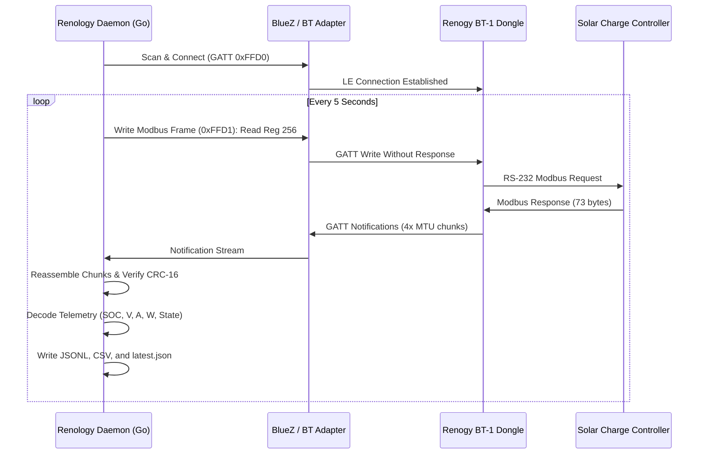

# Renology ☀️🔋

[](https://go.dev/)
[](https://opensource.org/licenses/MIT)
[](https://www.bluetooth.com/)
[](#modbus-protocol)

**Renology** is a lightweight, enterprise-grade, 100% pure Go daemon that connects directly to **Renogy Solar Charge Controllers** via affordable Bluetooth Low Energy dongles (**BT-1** and **BT-2**).

It retrieves real-time battery and solar telemetry **every 5 seconds**, persists historical metrics to durable local time-series files, and provides an open, cloud-free foundation for off-grid power monitoring on RVs, campervans, boats, and remote cabins—without needing expensive Wi-Fi modules or vendor cloud subscriptions.

---

## ✨ Features

- **100% Pure Go**: Single static binary with zero runtime dependencies. Near-zero CPU and memory footprint (~15MB RAM), perfect for Raspberry Pi, Surface Go, Intel NUC, or embedded Linux routers.
- **No Cloud Required**: 100% local operation. Your solar and battery data never leaves your local network.
- **High-Frequency Polling**: Configurable polling interval (defaults to **5 seconds**) with defensive packet chunk reassembly and Modbus CRC-16 validation.
- **Triple-Mode Local Storage**:
  - `renology_telemetry.jsonl`: Append-only time-series ledger for historical analysis.
  - `latest_status.json`: Atomic live snapshot for instant consumption by local web dashboards or scripts.
  - `renology_history.csv`: Universal CSV spreadsheet format for Excel, pandas, and data logging.
- **Self-Healing Connection Engine**: Automated exponential backoff and recovery from BLE connection drops, weak signals (-100 dBm), and controller power cycles.
- **Comprehensive Hardware Support**: Renogy Rover, Wanderer, Adventurer, DCC50S DC-DC Chargers, Smart Lithium Batteries, and Smart Shunts.

---

## 🚀 Quick Start

### 1. Build the Binary
```bash
# Clone the repository
git clone https://github.com/fkcurrie/renology.git
cd renology

# Run tests
go test -v ./...

# Compile the standalone executable
go build -o renology main.go
```

### 2. Run the Poller
```bash
# Run with default settings (scans for BT-TH-* device, polls every 5s)
./renology

# Specify custom MAC address and polling interval
./renology -mac 60:98:66:F9:84:D6 -interval 5 -out ./data -verbose
```

### 3. Example Console Output
```text
=====================================================
  Renogy Solar Telemetry Poller (Go Native)
=====================================================
 Target MAC:       60:98:66:F9:84:D6
 Poll Interval:    5 seconds
 Modbus Device ID: 0xFF (255)
 Storage Dir:      /home/fcurrie/Projects/renology/data
 Output Files:
   - /home/fcurrie/Projects/renology/data/renology_telemetry.jsonl (append-only history)
   - /home/fcurrie/Projects/renology/data/latest_status.json (live snapshot)
   - /home/fcurrie/Projects/renology/data/renology_history.csv (CSV spreadsheet)
=====================================================
[14:20:05] RNG-CTRL-RVR40 | Battery: 98% 13.6V 15.42A (209.7W) | Solar PV: 36.2V 5.80A (210W) | State: MPPT | Today: 480 Wh
[14:20:10] RNG-CTRL-RVR40 | Battery: 98% 13.6V 15.40A (209.4W) | Solar PV: 36.2V 5.79A (210W) | State: MPPT | Today: 481 Wh
```

---

## ⚙️ Configuration & Flags

| Flag | Default | Description |
| :--- | :--- | :--- |
| `-mac` | `60:98:66:F9:84:D6` | Target Renogy Bluetooth MAC address |
| `-interval` | `5` | Polling interval in seconds |
| `-out` | `./data` | Directory to store JSONL, CSV, and latest status files |
| `-device-id` | `255` | Modbus Device ID (`0xFF` broadcast or `0x01`) |
| `-verbose` | `false` | Enable verbose packet-level debug logging |

---

## 📡 Modbus Over BLE Architecture



---

## 🗺️ Roadmap

- [x] Pure Go Modbus RTU frame builder, parser, and CRC-16 validator.
- [x] High-frequency 5-second polling engine with auto-reconnect backoff.
- [x] Multi-format local persistence (JSONL, CSV, atomic latest status).
- [ ] **Phase 3**: Embedded real-time web dashboard with live dials and charts.
- [ ] **Phase 4**: MQTT publisher for Home Assistant native integration.
- [ ] **Phase 5**: Prometheus `/metrics` exporter for Grafana dashboards.

---

## 📄 License

MIT License. Copyright (c) 2026 fcurrie.
See [LICENSE](LICENSE) for full details.
