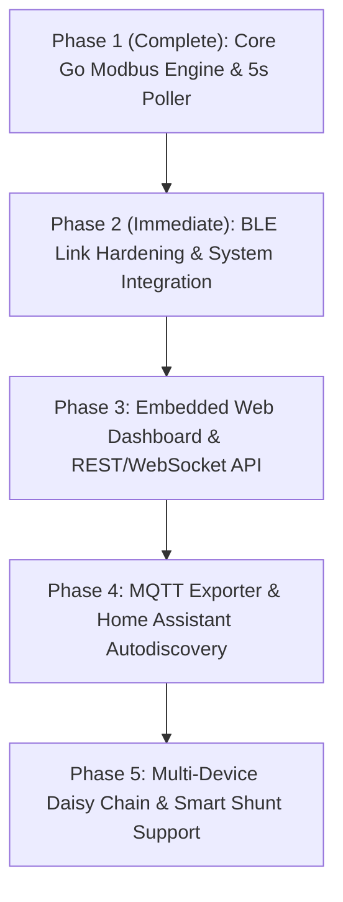

# SOUL.md - Renology System Manifesto & Architecture

> *"Empowering off-grid energy independence through local, enterprise-grade, open-source solar telemetry."*

---

## 1. Mission & Vision

Remote and off-grid solar energy systems—whether installed on RVs, campervans, marine vessels, overland expeditions, remote cabins, or off-grid homesteads—rely on charge controllers (e.g., Renogy Rover, Wanderer, Adventurer, DCC50S) to regulate battery health and solar harvesting.

Historically, monitoring these systems remotely forced users into an unfair dilemma:
1. Pay steep premiums for proprietary, cloud-tethered Wi-Fi/cellular modules that fail when Internet connectivity is lost.
2. Rely on buggy, closed-source mobile applications that require manual pairing and proximity.

**Renology** solves this permanently. Written 100% in pure Go, Renology acts as a robust, non-intrusive BLE-to-Modbus bridge that communicates directly with low-cost Renogy Bluetooth dongles (BT-1 and BT-2). It streams real-time battery and solar metrics locally every 5 seconds, persists historical data to durable local storage, and provides a foundation for local dashboards, Home Assistant integration, and remote telemetry without requiring any cloud services or proprietary hardware.

---

## 2. Core Architectural Principles

### 2.1 Local-First & Zero Cloud Dependency
All telemetry belongs to the user. Renology functions completely offline without any internet connection. No tracking, no external API keys, no subscription paywalls.

### 2.2 Enterprise-Grade Engineering in Pure Go
- **Zero Python / Zero Heavy Runtimes**: Compiled to a static, lightweight binary with near-zero CPU and memory overhead (~15MB RAM), ideal for low-power edge nodes (Raspberry Pi, Surface Go, Intel NUC, embedded routers).
- **Type Safety & Data Integrity**: Strict Go struct definitions, hardware-accurate bitfield conversions, and rigorous Modbus RTU CRC-16 checksum validation on every frame.
- **Fail-Safe Resilience**: Self-healing connection loops with exponential backoff, handling BLE link loss, weak RF environments (-100 dBm), and adapter reinitializations automatically.

### 2.3 Transparent, Structured Storage
Renology stores telemetry simultaneously across three decoupled formats:
1. **`renology_telemetry.jsonl`**: Append-only JSON Lines time-series ledger for long-term historical analysis and parsing.
2. **`latest_status.json`**: Atomically written live snapshot allowing any third-party daemon, web server, or script to instantly read the current state without file locking collisions.
3. **`renology_history.csv`**: Universal tabular spreadsheet format compatible with Excel, pandas, and data science tooling.

---

## 3. Hardware & Protocol Blueprint

### 3.1 Bluetooth Low Energy (BLE) GATT Architecture
Renogy BT-1/BT-2 dongles utilize Texas Instruments BLE transceivers (CC2541 / CC2640) operating as a transparent serial-to-BLE GATT bridge:
- **TX Service (Write)**: `0000ffd0-0000-1000-8000-00805f9b34fb` (Short `0xFFD0`)
  - **TX Characteristic**: `0000ffd1-0000-1000-8000-00805f9b34fb` (Short `0xFFD1`)
- **RX Service (Notify)**: `0000fff0-0000-1000-8000-00805f9b34fb` (Short `0xFFF0`)
  - **RX Characteristic**: `0000fff1-0000-1000-8000-00805f9b34fb` (Short `0xFFF1`)

### 3.2 Modbus RTU Encapsulation
Queries are transmitted as raw Modbus RTU frames over GATT characteristic `0xFFD1`. The controller responds via notifications on `0xFFF1`:
- **Default Device ID**: `0xFF` (255 broadcast / controller default) or `0x01`
- **Function Code**: `0x03` (Read Holding Registers)
- **Key Register Addresses**:
  - `0x000C` (12): Controller Model Name (8 registers / 16 bytes ASCII)
  - `0x001A` (26): Controller Hardware / Device ID (1 register)
  - `0x0100` (256): Real-time Telemetry Block (34 registers / 68 bytes)
    - Battery SOC (%), Battery Voltage (0.1V), Charging Current (0.01A)
    - Controller & Battery Temperatures (°C)
    - Solar PV Voltage (0.1V), PV Current (0.01A), PV Power (W)
    - Daily Min/Max Voltages, Daily Energy Produced (Wh), Cumulative Energy (kWh)
    - Load State, Charging Mode (MPPT, Boost, Float, Equalize), Fault Flags
  - `0xE004` (57348): Battery Chemistry Profile (Open, Sealed, Gel, Lithium, Custom)

---

## 4. Multi-Phase Roadmap

### Phase 1: Core Engine & Resilient Poller (Current)
- Complete Modbus RTU packet builder, parser, and CRC-16 validator.
- Autonomous polling loop targeting 5-second intervals.
- Concurrent file storage engine (`.jsonl`, `.csv`, `latest.json`).
- Unit test suite covering frame construction, error handling, and math precision.

### Phase 2: BLE Link Hardening & System Resilience
- Tuned Linux BlueZ connection supervision timeouts for extreme fringe signals (-100 dBm).
- Passive scan fallback to capture advertised battery telemetry when link layer synchronization fails.
- Prevention of local subsystem locks (BlueZ auto-connect conflicts, Blueman interference).
- Linux systemd service configuration for non-root execution.

### Phase 3: Embedded Web Dashboard
- Lightweight embedded HTTP server in Go with zero external dependencies.
- WebSocket live feed streaming battery voltage, solar power, and charging state every 5 seconds.
- Clean, high-contrast, mobile-friendly responsive dashboard (dark mode solar gauge).

### Phase 4: Integrations & Extensibility
- Native MQTT publisher compatible with Home Assistant MQTT discovery.
- Prometheus `/metrics` exposition for Grafana dashboards.

---

## 5. Security & Quality Standards

1. **Least Privilege**: Renology does not require running as `root`. Network and Bluetooth capabilities (`cap_net_raw,cap_net_admin+eip`) allow unprivileged operation.
2. **Memory Safety & Concurrency**: All access to BLE characteristics, response buffers, and file writers is strictly synchronized via Go primitives (`sync.Mutex`, buffered channels). Zero race conditions (`go test -race`).
3. **No External Attack Surface**: No unauthenticated remote execution. The future web interface will bind locally by default with optional token-based authentication.
4. **Reproducible Builds**: Standard Go modules (`go.mod`, `go.sum`) with no CGo dependencies where possible.
